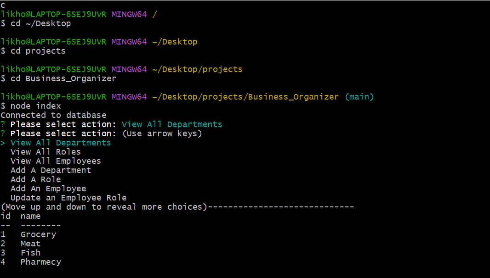

# Title
Business Organizer

# Table of Contents
[Description](#description)

[Installation](#instalation)

[Usage](#usage)

[License](#license)

[Contributors](#contributors)

[Tests](#tests)

[Questions](#questions)

## Description
A simple javascript program that uses mySQL to create dperatments, roles and employees for a business.

## Installation
Clone the repo from the GitHun page and type npm i in the terminal to install all the dependencies, once done, souce in the db and the schema sql files to create the database and the tables in mysql database system. After that simply run the applocation by typing node index in the terminal.

## Usage
Used to maintain depratments, roles and employees in a small business and keep track of things.

## Walkthrough Video
https://drive.google.com/file/d/1u6yxuuWFujibOQ8G-acbbs_23Ux0UN3B/view

## Contribution
Linkhon Hasan

## Tests
N/A

## Questions
GitHub: MKHLink

Email: likhonhasankomol@gmail.com
    
